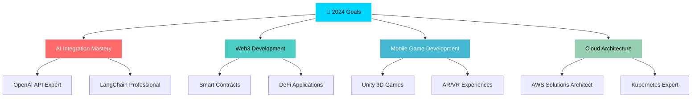

# 🚀 Sneh Jaiswal | Full-Stack Developer & AI Innovator

<div align="center">
  
</div>

<div align="center">
  
</div>

## 🌟 Digital Identity Matrix

<table>
<tr>
<td width="45%">

### 👨‍💻 Professional Nexus
```yaml
developer:
  experience: "3+ Years at PNP Infotech"
  specialty: "MERN Stack Architecture"
  passion: ["AI Automation", "Game Development"]
  mission: "Transforming Ideas into Reality"
  
current_quest:
  - 🔥 Building AI-Powered Applications
  - 🎮 Creating Immersive Game Experiences  
  - 🌐 Contributing to Open Source Universe
  - 📱 Crafting Mobile Solutions
  
personality:
  traits: ["Problem Solver", "Tech Enthusiast"]
  motto: "Debug with Coffee, Deploy with Confidence"
  superpower: "Turning Complex Problems into Elegant Solutions"
```

</td>
<td width="55%">

### 🎯 Tech DNA Sequence
```javascript
const snehJaiswal = {
    location: "🇮🇳 India",
    languages: {
        expert: ["JavaScript", "TypeScript", "Python"],
        learning: ["Rust", "Go", "WebAssembly"]
    },
    architecture: {
        frontend: ["React ⚛️", "React Native 📱", "Next.js ⚡"],
        backend: ["Node.js 🟢", "Express.js 🚀", "FastAPI 🐍"],
        database: ["MongoDB 🍃", "PostgreSQL 🐘", "Redis ⚡"],
        ai_ml: ["OpenAI 🤖", "LangChain 🔗", "TensorFlow 🧠"],
        cloud: ["AWS ☁️", "Firebase 🔥", "Vercel ▲"]
    },
    currentlyMastering: ["Advanced AI Agents", "Web3 Development"],
    codingStyle: "Clean, Scalable, Performance-Optimized",
    workingHours: "24/7 (Powered by Passion & Coffee ☕)"
};

console.log("Ready to build amazing things! 🚀");
```

</td>
</tr>
</table>

<div align="center">
  
</div>

## 🔗 Digital Connect Hub

<div align="center">
  
[](mailto:snehjaiswal20@gmail.com)
[](https://snehtech.vercel.app/)
[](https://www.linkedin.com/in/sneh-jaiswal-431165229)
[](https://www.instagram.com/mr_jaiswal001/?hl=en)
[](https://twitter.com/snehpnp)
[](https://discord.gg/snehpnp)

</div>

<div align="center">
  
  
  
  
  
</div>

## ⚡ Tech Arsenal 2.0

<div align="center">
  
  <br><br>
  
  <!-- Advanced Frontend Technologies -->
  
  
  
  
  
  
  
  <!-- Backend & Database Technologies -->
  
  
  
  
  
  
  
  <!-- AI & Machine Learning -->
  
  
  
  
  
  <!-- Cloud & DevOps -->
  
  
  
  
  
  
  <!-- Development Tools -->
  
  
  
  
  
</div>

<div align="center">
  
</div>

## 📊 GitHub Analytics Command Center

<div align="center">
  
  <!-- Animated Profile Counter -->
  
  
  
  
</div>

<div align="center">
  <!-- GitHub Stats Cards with Modern Design -->
  <table>
    <tr>
      <td width="50%">
        
      </td>
      <td width="50%">
        
      </td>
    </tr>
  </table>
</div>

## 🎯 Coding Activity & Performance Analytics

<div align="center">
  
  <!-- Enhanced Language Stats -->
  
  
  <!-- Weekly Development Activity -->
  <br><br>
  
  
</div>

## 🏆 Achievement Gallery & Milestones

<div align="center">
  
  <!-- GitHub Trophies with Custom Theme -->
  
  
  <!-- Custom Achievement Badges -->
  <br><br>
  
  
  
  
  
</div>

## 🎮 Developer Fun Zone & Statistics

<div align="center">
  <table>
    <tr>
      <td width="50%">
        
### 🎯 Coding Metrics Dashboard
```yaml
📊 Performance Stats:
  • Lines of Code Written: 75,000+ 
  • Projects Completed: 40+
  • Bugs Fixed: 500+ 🐛
  • Features Deployed: 200+
  • Coffee Consumed: ∞ ☕
  • Late Night Coding: 365 days 🌙
  
🎮 Gaming Stats:
  • Favorite Games: Strategy & RPG
  • Coding Music: Lo-fi & Synthwave
  • Debugging Style: Rubber Duck 🦆
  • Weekend Activity: Open Source
```

      </td>
      <td width="50%">
        
### 🌟 Quick Developer Facts
- 🔥 **Started Coding**: 2020
- ⚡ **Favorite Language**: JavaScript
- 🎯 **Dream Project**: AI-Powered Game Engine
- 🌍 **Time Zone**: IST (GMT+5:30)
- 🎨 **Design Philosophy**: "Simple yet Powerful"
- 🚀 **Next Goal**: Contributing to Major Open Source
- 🎵 **Coding Playlist**: 1000+ Songs
- 📚 **Always Learning**: New Technologies Daily


      </td>
    </tr>
  </table>
</div>

## 🎨 Unique Visualizations & Animations

<div align="center">
  
  <!-- Snake Animation with Custom Colors -->
  <picture>
    <source media="(prefers-color-scheme: dark)" srcset="https://github.com/snehpnp/snehpnp/blob/output/github-contribution-grid-snake-dark.svg">
    <source media="(prefers-color-scheme: light)" srcset="https://github.com/snehpnp/snehpnp/blob/output/github-contribution-grid-snake.svg">
    
  </picture>
  
  <!-- 3D Contribution Calendar -->
  <br><br>
  
  
</div>

## 📈 Advanced Productivity & Performance Metrics

<div align="center">
  
  <!-- Comprehensive Profile Summary -->
  
  
  <table>
    <tr>
      <td width="50%">
        
      </td>
      <td width="50%">
        
      </td>
    </tr>
    <tr>
      <td width="50%">
        
      </td>
      <td width="50%">
        
      </td>
    </tr>
  </table>
  
</div>

## 🎭 Daily Developer Wisdom

<div align="center">
  
  <!-- Random Programming Quote -->
  
  
  <!-- Daily Coding Joke -->
  <br><br>
  
  
</div>

## 🚀 Featured Projects Showcase

<div align="center">
  <table>
    <tr>
      <td width="50%">
        
      </td>
      <td width="50%">
        
      </td>
    </tr>
    <tr>
      <td width="50%">
        
      </td>
      <td width="50%">
        
      </td>
    </tr>
  </table>
</div>

## 🌟 Community & Support Network

<div align="center">
  
  <!-- Support Badges -->
  [](https://buymeacoffee.com/snehpnp)
  [](https://github.com/sponsors/snehpnp)
  [](https://patreon.com/snehpnp)
  
  <!-- Community Badges -->
  <br><br>
  [](https://stackoverflow.com/users/snehpnp)
  [](https://medium.com/@snehpnp)
  [](https://youtube.com/@snehpnp)
  
</div>

## 🎯 Current Learning & Future Goals

<div align="center">
  


</div>

## 🎨 Skill Progression Matrix

<div align="center">
  
| Technology | Proficiency | Experience | Projects |
|:----------:|:-----------:|:----------:|:--------:|
| **JavaScript** | ████████████ 95% | 3+ Years | 25+ |
| **React/Next.js** | ███████████ 90% | 3+ Years | 20+ |
| **Node.js** | ██████████ 85% | 3+ Years | 15+ |
| **TypeScript** | █████████ 80% | 2+ Years | 12+ |
| **Python** | ████████ 75% | 2+ Years | 10+ |
| **MongoDB** | ████████ 75% | 2+ Years | 15+ |
| **AI/ML** | ███████ 70% | 1+ Year | 8+ |
| **React Native** | ██████ 65% | 1+ Year | 5+ |
| **AWS** | ██████ 60% | 1+ Year | 6+ |
| **Docker** | █████ 55% | Learning | 3+ |

</div>

---

<div align="center">
  
  <!-- Footer Animation -->
  
  
  ### 💫 "The best way to predict the future is to create it." - Peter Drucker
  
  **🚀 Ready to collaborate on your next big idea? Let's connect and make it happen!**
  
  <!-- Animated Footer Icons -->
  
  <br>
  
  
  <!-- Social Media Follow Buttons -->
  <br><br>
  [](https://github.com/snehpnp)
  [](https://www.linkedin.com/in/sneh-jaiswal-431165229)
  [](https://twitter.com/snehpnp)
  
  <br>
  
  
  
  
</div>
